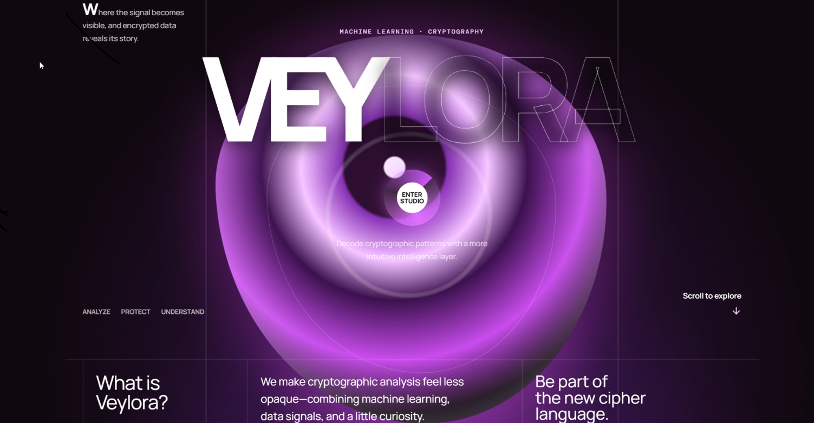
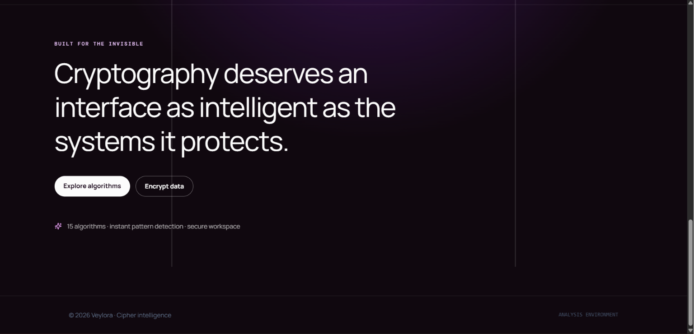
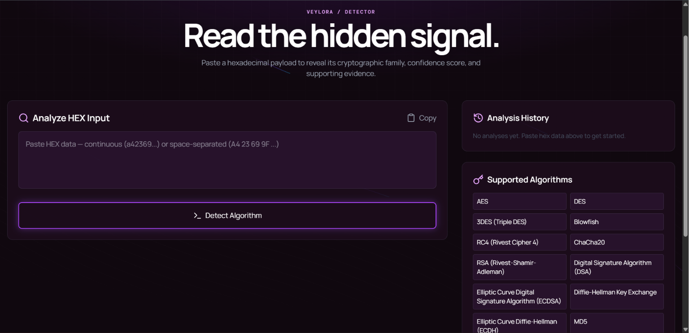
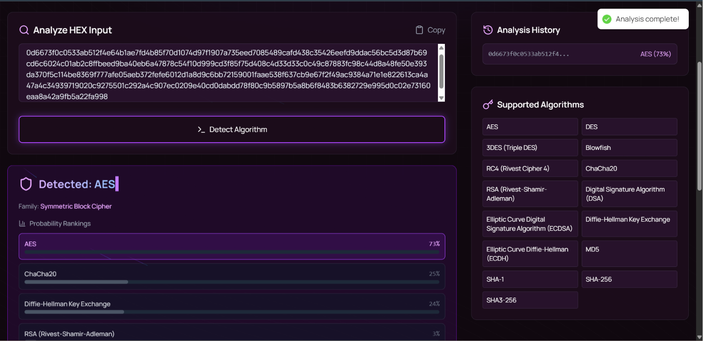
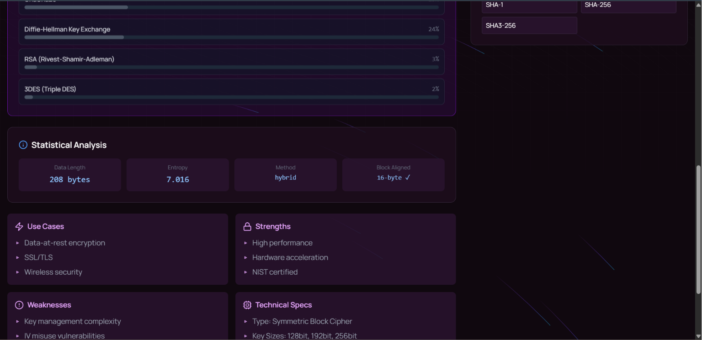
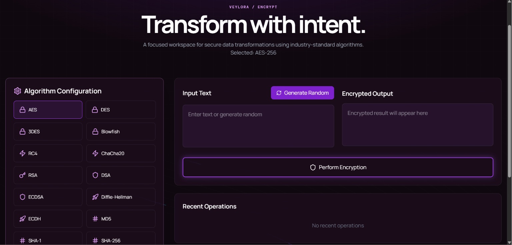
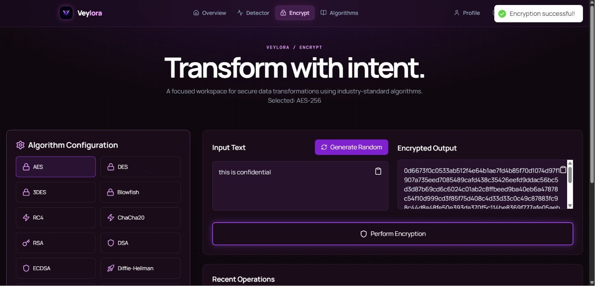
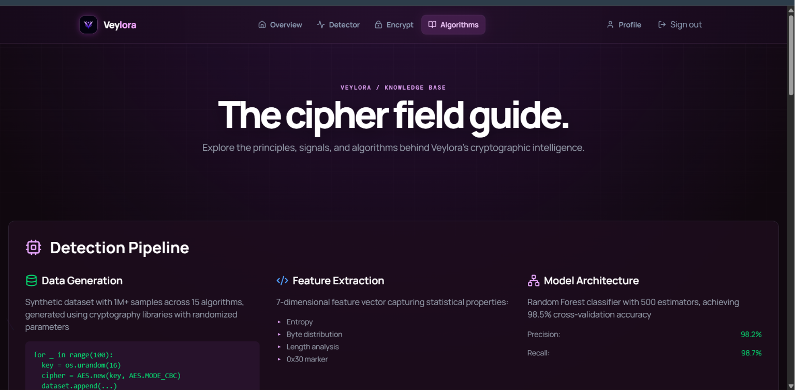
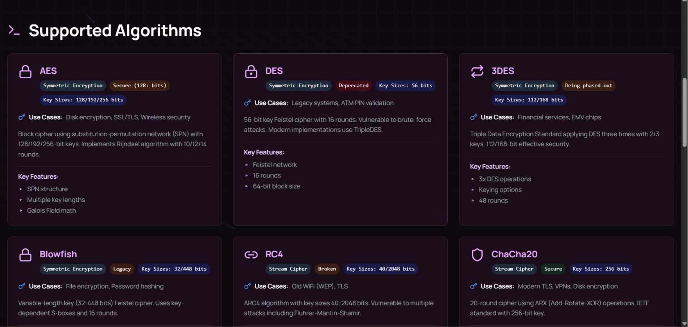

# VEYLORA

> Decode cryptographic patterns with a more intuitive intelligence layer.

---

## 📖 Overview

In today's digital landscape, cryptographic algorithms are the backbone of secure communication, data protection, and privacy. However, identifying the specific cryptographic algorithm used in a given dataset or communication stream is highly complex and time-consuming when done manually.

**VEYLORA** is an intelligent platform that combines machine learning with deterministic rule-based analysis to automatically identify cryptographic algorithms from raw encrypted data. It empowers security analysts, researchers, and developers to analyze, protect, and understand cryptographic signals — all through a modern, purpose-built interface.

---

## ✨ Features

- **Hybrid Algorithm Detection** — A 3-layer classification engine combining structural rules with a Random Forest ML model to identify 15+ cryptographic algorithms
- **Encryption Toolkit** — Generate encrypted outputs using industry-standard algorithms (AES, DES, 3DES, Blowfish, RC4, ChaCha20, RSA, DSA, ECDSA, and more)
- **Statistical Analysis** — Displays entropy, byte distribution, data length, block alignment, and classification method for every prediction
- **Algorithm Knowledge Base** — Detailed reference cards for each supported algorithm including key sizes, use cases, strengths, and weaknesses
- **Analysis History** — Authenticated users can track and revisit past predictions with confidence scores
- **Security Insights** — Automatically flags insecure patterns like ECB mode usage or low-entropy outputs
- **JWT Authentication** — Secure signup, login, token refresh, and session management

---

## 🛠 Tech Stack

| Layer | Technologies |
|-------|-------------|
| **Frontend** | React, Vite, TypeScript, Tailwind CSS, PostCSS, ShadCN, Aceternity UI, Axios |
| **Backend** | Java 17+, Spring Boot, Spring Security, JWT, JPA / Hibernate |
| **Database** | PostgreSQL |
| **Machine Learning** | Python 3, Scikit-Learn (Random Forest), NumPy, Pandas, SciPy, PyCryptodome |
| **Integration** | Java ProcessBuilder → Python inference scripts, REST API |

---

## 📸 Screenshots

### Landing Page
The hero section introduces VEYLORA's purpose with an immersive visual and a clear call-to-action to enter the studio.





---

### Algorithm Detection
Users paste raw hexadecimal data and the hybrid ML engine classifies it, returning the detected algorithm, confidence-ranked probability bars, and a list of supported algorithms.







---

### Encryption Workspace
A focused workspace for secure data transformations. Select any of the 15 supported algorithms, input or generate random plaintext, and produce the encrypted output instantly.





---

### Algorithm Knowledge Base
A comprehensive reference covering the detection pipeline, feature extraction methodology, and detailed cards for every supported algorithm — including key sizes, security status, use cases, and technical specifications.





---

## 🏗 Architecture & Workflow

### Overall System Data Flow

This diagram illustrates the high-level architecture of the VEYLORA platform. It outlines how a user interacts with the web or mobile interface, which communicates with the Application Server. The server orchestrates authentication, interacts with the PostgreSQL database, and delegates cryptographic analysis to the Random Forest ML Service before returning the processed results to the user.


---

### Machine Learning Architecture

The ML data flow details the Random Forest prediction model. The system ingests original training data, randomizes it, and distributes it across multiple decision trees. The individual predictions are then aggregated using voting or averaging to produce a highly accurate final prediction.


---

### User Authentication Data Flow

This flowchart outlines the secure user authentication lifecycle. It covers the entire journey from user registration (Sign Up) and login credential validation, through successful authentication and session management (including token refreshing), to logging out and ending the session.


---

### Prediction Activity Flow

The prediction pipeline follows a structured approach. When a user uploads a cryptographic dataset, the system preprocesses it to extract features. The model analyzes these features and either successfully identifies the algorithm or throws a prediction exception if unrecognized.


---

### Authentication & Token Management

This diagram breaks down the authentication process into three distinct flows: User Signup, User Login, and Refresh Token. It details credential validation, error handling, and the generation of secure Access and Refresh tokens.


---

### Encryption Process

The encryption module handles secure data transformations. Users select an encryption algorithm and provide plaintext input. The system initializes parameters (like keys and IVs) and performs the encryption, returning the ciphertext upon success.


---

### System Context & Class Diagram

The Level 0 context diagram shows the primary interactions between the user and the AI/ML-Based Cryptographic Algorithm Identification System. Level 1 and Level 2 diagrams break down user management, data ingestion, and the intricate steps of the ML model prediction process.


---

### Use Case Diagram

The use case diagram highlights the primary actors and their interactions with the system, such as generating signatures, encrypting data, viewing search history, and predicting algorithms.


---

### Sequence Diagrams

These sequence diagrams map the step-by-step interactions between system components during key operations.

| Flow | Diagram |
|------|---------|
| **Login** |  |
| **Signup** |  |
| **Token Refresh** |  |

---

### State Diagrams

The state diagrams illustrate the lifecycle and various states of different system modules during their execution.

| Component | Diagram |
|-----------|---------|
| **Prediction** |  |
| **Encryption** |  |


---

## 📂 Project Structure

```
VEYLORA/
├── Backend/                           # Spring Boot application
│   ├── src/main/java/.../
│   │   ├── Controllers/               # REST API endpoints
│   │   ├── Services/                   # Business logic & ML integration
│   │   ├── Entities/                   # JPA entities & request/response models
│   │   ├── Repositories/              # Database access layer
│   │   ├── Filters/                    # JWT authentication filter
│   │   ├── Configurations/            # Security & app config
│   │   └── Exceptions/                # Custom exception handling
│   ├── src/main/resources/
│   │   ├── scripts/                    # Python ML engine (predict.py, train_model.py)
│   │   ├── application.properties      # Backend configuration
│   │   └── data.sql                    # Seed data for algorithms
│   └── images/                         # Architecture & UML diagrams
│
├── Frontend/                           # React + Vite application
│   ├── src/
│   │   ├── components/                 # Page components (Dashboard, Detector, Encrypt, etc.)
│   │   ├── components/ui/              # Reusable UI primitives (cards, inputs, effects)
│   │   ├── redux/                      # Global state management
│   │   └── lib/                        # Utility functions
│   └── tailwind.config.js              # Tailwind CSS configuration
│
├── UI_Image/                           # Application screenshots
├── .gitignore                          # Git ignore rules
├── .env.example                        # Environment variable template
└── README.md
```

---

## 🤝 Contributing

Contributions are welcome. To get started:

1. Fork the repository
2. Create a feature branch (`git checkout -b feature/your-feature`)
3. Commit your changes with clear, descriptive messages
4. Push to the branch (`git push origin feature/your-feature`)
5. Open a Pull Request

> **Note:** Do not commit `.env` files, `.pickle` model files, or any credentials.

---

## 📜 License

This project is licensed under the MIT License.
