# VEYLORA

> Decode cryptographic patterns with a more intuitive intelligence layer.

---

## 📖 Overview

In today's digital landscape, cryptographic algorithms are the backbone of secure communication, data protection, and privacy. However, identifying the specific cryptographic algorithm used in a given dataset or communication stream is highly complex and time-consuming when done manually.

**VEYLORA** is an intelligent platform that combines machine learning with deterministic rule-based analysis to automatically identify cryptographic algorithms from raw encrypted data. It empowers security analysts, researchers, and developers to analyze, protect, and understand cryptographic signals — all through a modern, purpose-built interface.

---

## ✨ Features

- **Hybrid Algorithm Detection** — A 3-layer classification engine combining structural rules with a Random Forest ML model to identify 15+ cryptographic algorithms
- **Encryption Toolkit** — Generate encrypted outputs using industry-standard algorithms (AES, DES, 3DES, Blowfish, RC4, ChaCha20, RSA, DSA, ECDSA, and more)
- **Statistical Analysis** — Displays entropy, byte distribution, data length, block alignment, and classification method for every prediction
- **Algorithm Knowledge Base** — Detailed reference cards for each supported algorithm including key sizes, use cases, strengths, and weaknesses
- **Analysis History** — Authenticated users can track and revisit past predictions with confidence scores
- **Security Insights** — Automatically flags insecure patterns like ECB mode usage or low-entropy outputs
- **JWT Authentication** — Secure signup, login, token refresh, and session management

---

## 🛠 Tech Stack

| Layer | Technologies |
|-------|-------------|
| **Frontend** | React, Vite, TypeScript, Tailwind CSS, PostCSS, ShadCN, Aceternity UI, Axios |
| **Backend** | Java 17+, Spring Boot, Spring Security, JWT, JPA / Hibernate |
| **Database** | PostgreSQL |
| **Machine Learning** | Python 3, Scikit-Learn (Random Forest), NumPy, Pandas, SciPy, PyCryptodome |
| **Integration** | Java ProcessBuilder → Python inference scripts, REST API |

---

## 📸 Screenshots

### Landing Page
The hero section introduces VEYLORA's purpose with an immersive visual and a clear call-to-action to enter the studio.


---

### Algorithm Detection
Users paste raw hexadecimal data and the hybrid ML engine classifies it, returning the detected algorithm, confidence-ranked probability bars, and a list of supported algorithms.


---

### Encryption Workspace
A focused workspace for secure data transformations. Select any of the 15 supported algorithms, input or generate random plaintext, and produce the encrypted output instantly.


---

### Algorithm Knowledge Base
A comprehensive reference covering the detection pipeline, feature extraction methodology, and detailed cards for every supported algorithm — including key sizes, security status, use cases, and technical specifications.


---

## 🏗 Architecture & Workflow

### Prediction Flow

The prediction pipeline follows a 3-layer hybrid approach. When a user submits encrypted hex data, the Spring Boot backend delegates it to the Python ML engine via ProcessBuilder. The engine extracts 27 statistical features (entropy, byte frequencies, autocorrelation, block repetition, etc.), runs them through deterministic structural rules first, and falls back to the Random Forest classifier for ambiguous cases. Results are merged with weighted scoring and returned as a structured JSON response to the frontend.

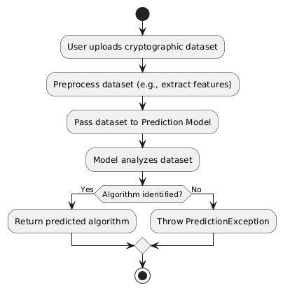

---

### Authentication Flow

User authentication is handled through a JWT-based system integrated with Spring Security. The flow covers signup, login, token refresh, and logout — ensuring that sessions, prediction history, and profile data remain securely isolated per user.

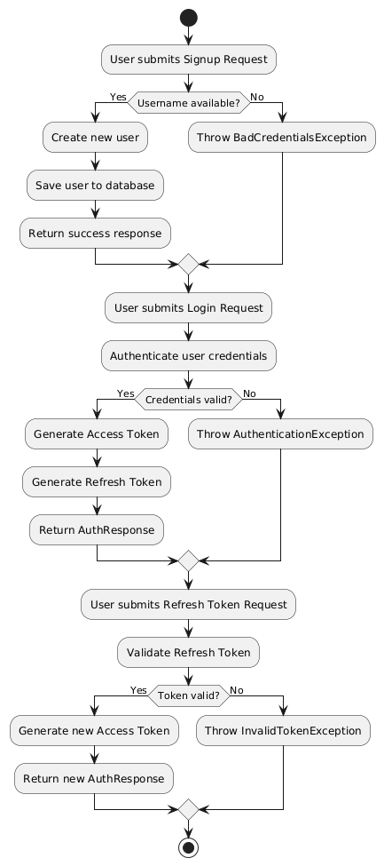

---

### Encryption Flow

The encryption module processes user requests through the backend's cryptographic service layer. Each algorithm has a dedicated endpoint, and the service generates keys, performs the transformation, and returns the hex-encoded output along with metadata for the frontend to display.

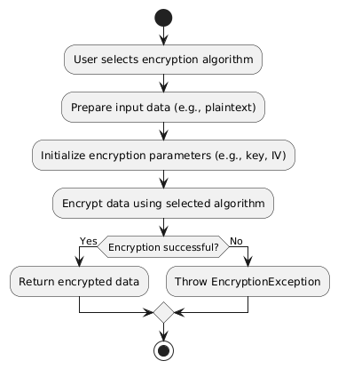

---

### System Design

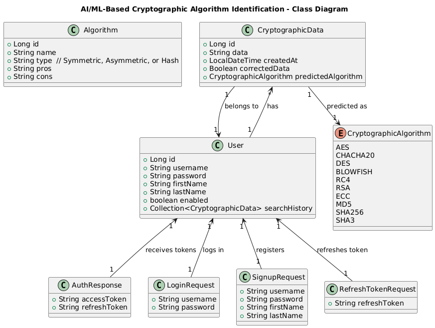

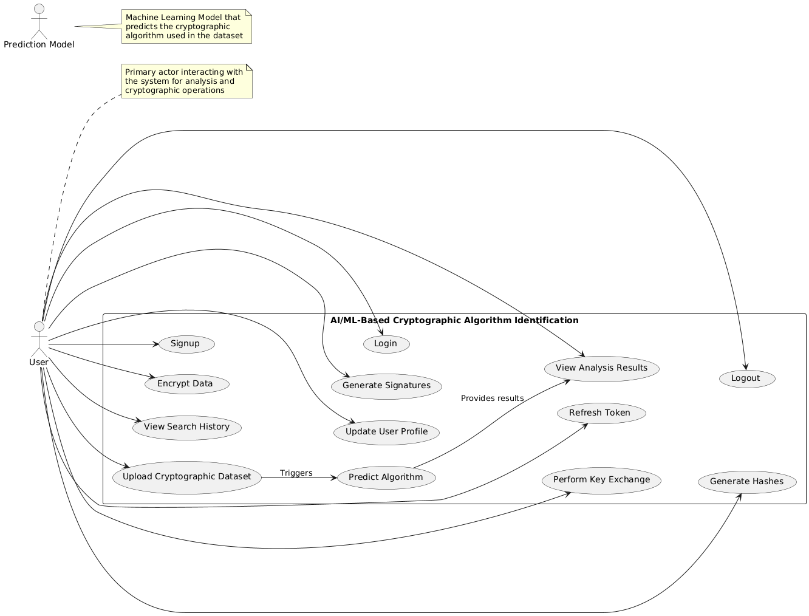

---

### Sequence Diagrams

| Flow | Diagram |
|------|---------|
| Login | 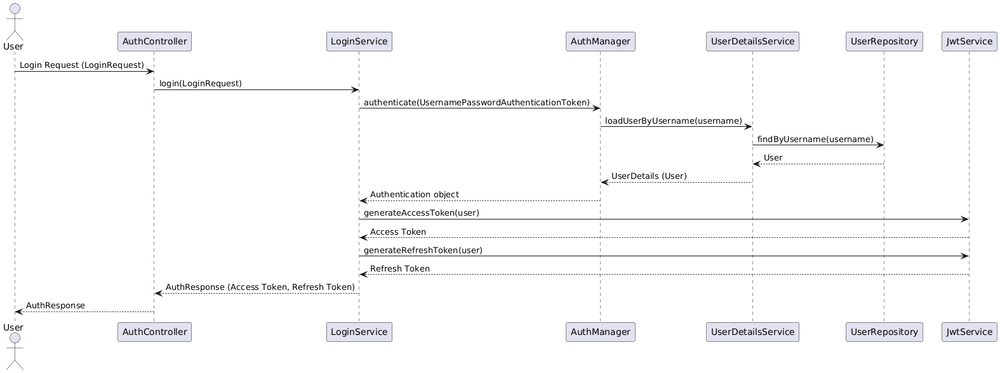 |
| Signup | 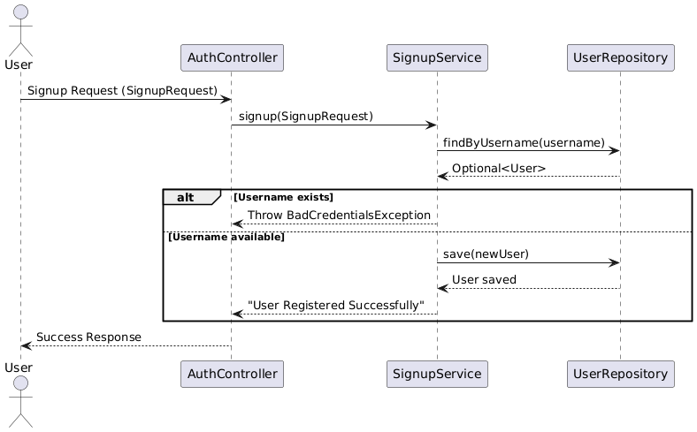 |
| Token Refresh | 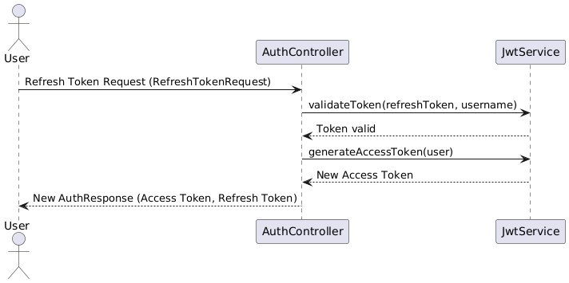 |

---

### State Diagrams

| Component | Diagram |
|-----------|---------|
| Prediction | 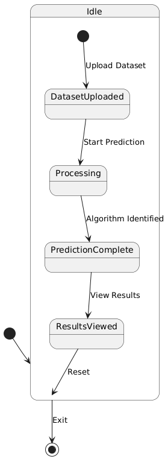 |
| Encryption | 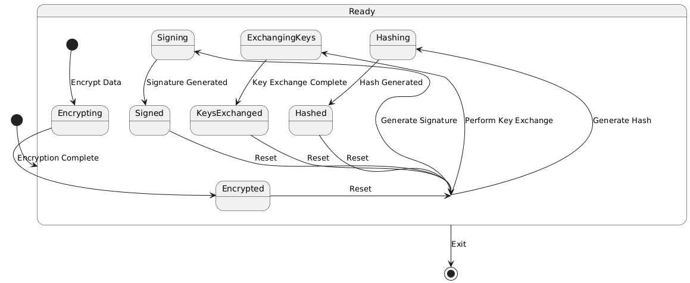 |
| User Authentication | 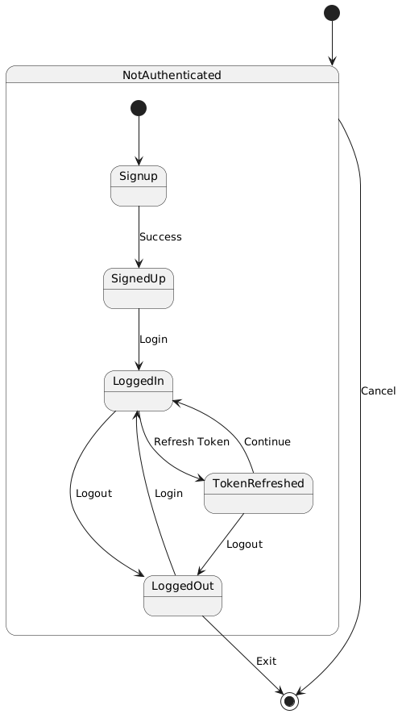 |
| User Profile | 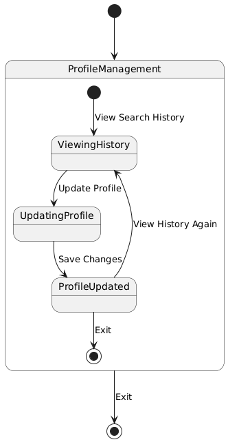 |

---

## 📂 Project Structure

```
VEYLORA/
├── Backend/                           # Spring Boot application
│   ├── src/main/java/.../
│   │   ├── Controllers/               # REST API endpoints
│   │   ├── Services/                   # Business logic & ML integration
│   │   ├── Entities/                   # JPA entities & request/response models
│   │   ├── Repositories/              # Database access layer
│   │   ├── Filters/                    # JWT authentication filter
│   │   ├── Configurations/            # Security & app config
│   │   └── Exceptions/                # Custom exception handling
│   ├── src/main/resources/
│   │   ├── scripts/                    # Python ML engine (predict.py, train_model.py)
│   │   ├── application.properties      # Backend configuration
│   │   └── data.sql                    # Seed data for algorithms
│   └── images/                         # Architecture & UML diagrams
│
├── Frontend/                           # React + Vite application
│   ├── src/
│   │   ├── components/                 # Page components (Dashboard, Detector, Encrypt, etc.)
│   │   ├── components/ui/              # Reusable UI primitives (cards, inputs, effects)
│   │   ├── redux/                      # Global state management
│   │   └── lib/                        # Utility functions
│   └── tailwind.config.js              # Tailwind CSS configuration
│
├── UI_Image/                           # Application screenshots
├── .gitignore                          # Git ignore rules
├── .env.example                        # Environment variable template
└── README.md
```

---

## 🤝 Contributing

Contributions are welcome. To get started:

1. Fork the repository
2. Create a feature branch (`git checkout -b feature/your-feature`)
3. Commit your changes with clear, descriptive messages
4. Push to the branch (`git push origin feature/your-feature`)
5. Open a Pull Request

> **Note:** Do not commit `.env` files, `.pickle` model files, or any credentials.

---

## 📜 License

This project is licensed under the MIT License.
